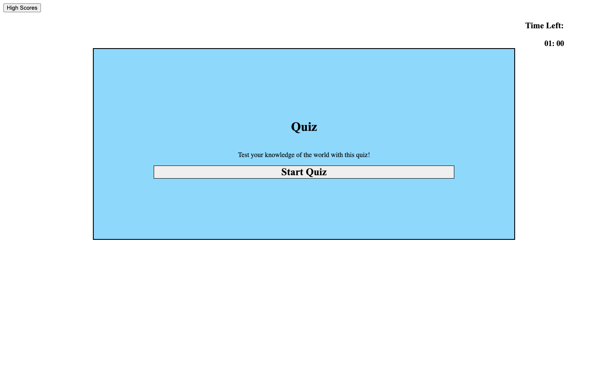
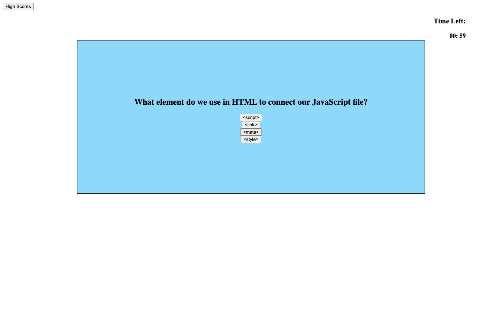
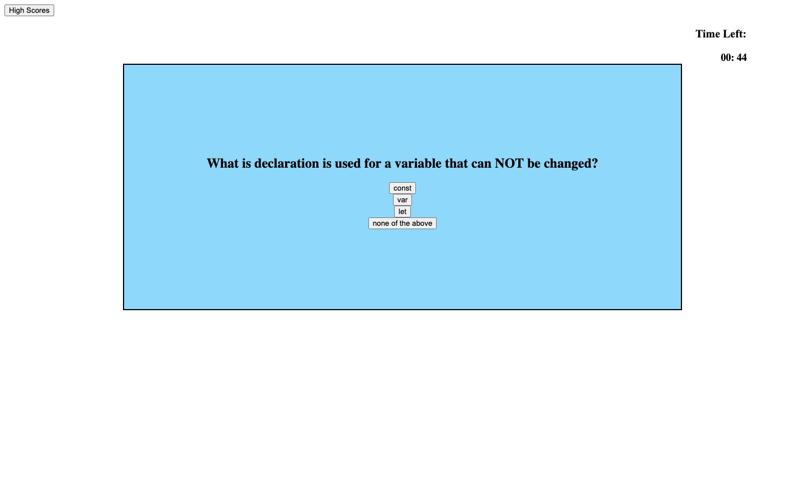
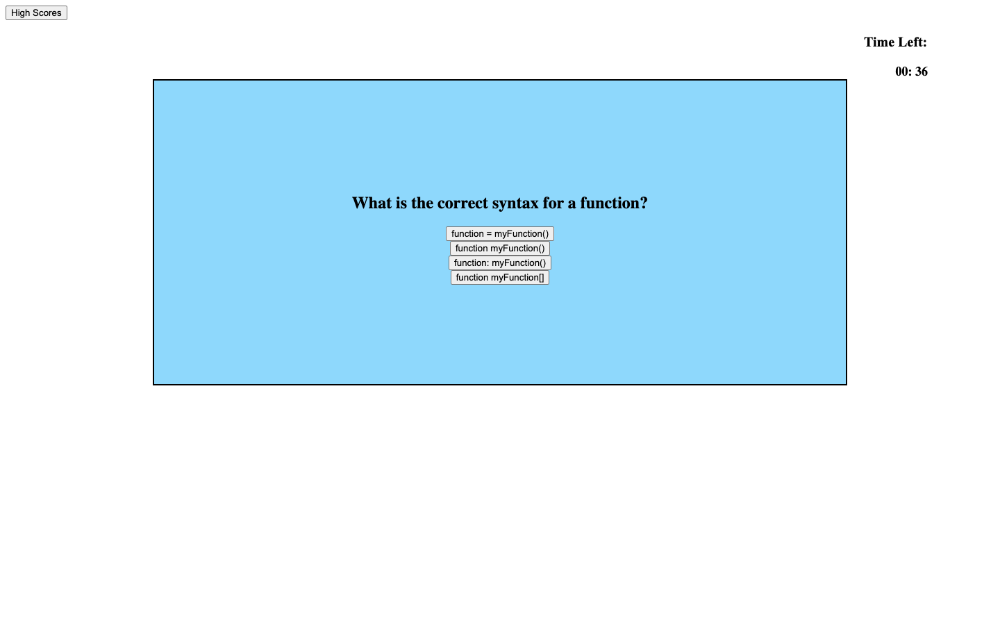
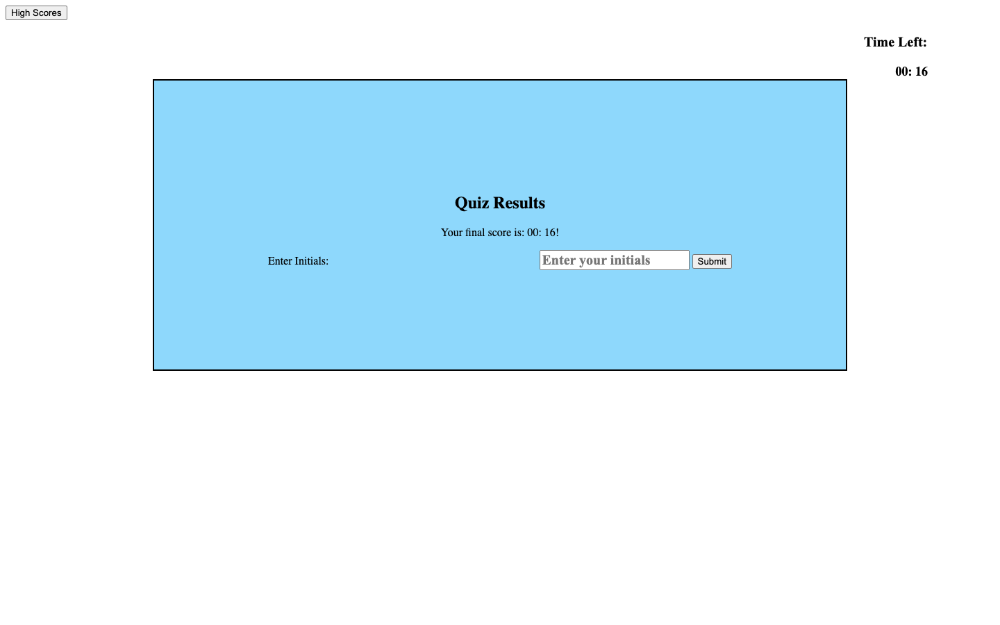

# quiz-time-04

Online quiz about JavaScript

## Table of Content

## Description

        !!! Still a few features under construction!!!

This online test is for users to test their coding knowledge. This test is easy to operate. The site will be updated in the future to be more comprehensive and provide for a longer quiz and pushing the user to help understand and test their skill and knowledge in JavaScrip.

## Usage

<Provide instructions and examples for use. Include screenshots as needed.>
App instructions begin with loading the app from the provided URL.  Then the user clicks on the 'Start Quiz' button.  This prompts the start screen to be hidden and for the first question to be visible.  The time begins as the first screen is loaded.  The user reads the question and decides the best answer that fits the question.  If they get the answer correct they move on to the next question without penalty.  If the question is answer incorrectly, at time deduction of 2 seconds is taken from them.  This continues until all answers are finished or the timer runs to zero.  The remaining time is then used as the score for the quiz.  !!! still under construction section!!! 
        This is then where the user will save their initials as well as their time/score, that will then be saved/logged on a separate high scores site that can be easily accessed by clicking the "High Scores" button in the upper left hand corner.

## Acknowledgments

Referenced following websites:

- https://codetheweb.blog/
- https://stackoverflow.com
- https://www.w3schools.com
- https://www.geeksforgeeks.org/
- Special thanks to Xpert, the AI Learning Assistant, for providing valuable assistance and guidance.

## License

---MIT License

Copyright (c) [2023] [Christopher Robert Naro]

Permission is hereby granted, free of charge, to any person obtaining a copy
of this software and associated documentation files (the "Software"), to deal
in the Software without restriction, including without limitation the rights
to use, copy, modify, merge, publish, distribute, sublicense, and/or sell
copies of the Software, and to permit persons to whom the Software is
furnished to do so, subject to the following conditions:

The above copyright notice and this permission notice shall be included in all
copies or substantial portions of the Software.

THE SOFTWARE IS PROVIDED "AS IS", WITHOUT WARRANTY OF ANY KIND, EXPRESS OR
IMPLIED, INCLUDING BUT NOT LIMITED TO THE WARRANTIES OF MERCHANTABILITY,
FITNESS FOR A PARTICULAR PURPOSE AND NONINFRINGEMENT. IN NO EVENT SHALL THE
AUTHORS OR COPYRIGHT HOLDERS BE LIABLE FOR ANY CLAIM, DAMAGES OR OTHER
LIABILITY, WHETHER IN AN ACTION OF CONTRACT, TORT OR OTHERWISE, ARISING FROM,
OUT OF OR IN CONNECTION WITH THE SOFTWARE OR THE USE OR OTHER DEALINGS IN THE
SOFTWARE.

🏆 The previous sections are the bare minimum, and your project will ultimately determine the content of this document. You might also want to consider adding the following sections.

## Features

- CSS design
- JavaScript

# JavaScript Quiz Time!
